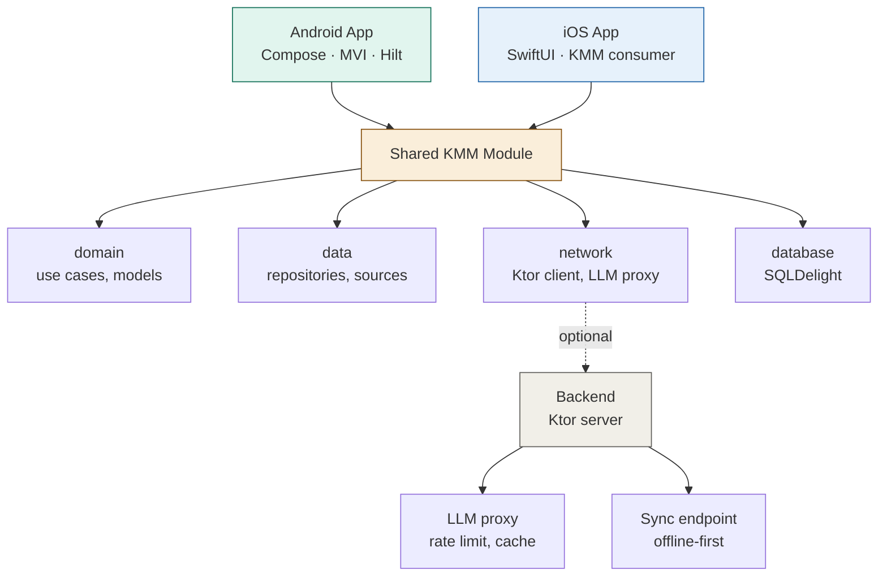

# MovementOS

> AI-powered personalized movement coach. Generates custom training programs, adapts to user's feedback, works offline.

**Status:** 🚧 In development — building in public

[](https://github.com/theunderseer-dev/movement-os/actions/workflows/ci.yml)
[](https://kotlinlang.org)
[](https://opensource.org/licenses/MIT)

---

## What it does

MovementOS generates personalized movement and yoga programs based on user's goals (flexibility, strength, back pain relief, mobility) and adapts each session based on how the previous one felt — automatically tuning difficulty over time.

Built as a flagship engineering portfolio project demonstrating production-grade Android architecture with KMM, modern Compose UI, and thoughtful LLM integration.

## Why this project

Most movement apps give you static programs. Real coaches adapt. This project explores how LLMs can replace the "adaptation" loop while keeping the engineering robust: predictable fallbacks, response caching, offline-first design, and clear boundaries between AI-generated content and deterministic logic.

## Tech stack

- **Language:** Kotlin 2.0
- **UI:** Jetpack Compose, Material 3
- **Cross-platform logic:** Kotlin Multiplatform Mobile (KMM)
- **Architecture:** Clean Architecture · MVI · Multi-module
- **DI:** Hilt (Android), Koin (KMM)
- **Async:** Coroutines, Flow, StateFlow
- **Persistence:** Room (Android), SQLDelight (KMM)
- **Networking:** Ktor Client (KMM)
- **AI:** LLM API integration (OpenAI / Claude / Gemini) with caching, fallback, rate limiting
- **Backend:** Ktor server (optional, for LLM proxy + sync)
- **Quality:** JUnit, MockK, Compose UI Tests, Maestro
- **CI/CD:** GitHub Actions, Detekt, ktlint

## Architecture



## Key engineering decisions

- **MVI over MVVM** — predictable state transitions, easier testing, better Compose interop
- **Offline-first** — every feature works without network; sync happens opportunistically
- **LLM with deterministic fallback** — when AI is unavailable, the app falls back to rule-based programme generation, so it always works
- **KMM for business logic only** — UI stays native (Compose / SwiftUI). Shared code: domain, data, network — not platform-specific UI

Detailed reasoning in [`/docs/architecture`](./docs/architecture).

## Status & roadmap

This is built in public over 4 weeks. Follow progress in the [project board](https://github.com/theunderseer-dev/movement-os/projects/1).

- [x] Project structure, multi-module, CI
- [ ] Domain & data layer (KMM)
- [ ] LLM integration with caching & fallback
- [ ] Compose UI core screens
- [ ] Background sync, notifications
- [ ] Testing, accessibility, polish
- [ ] v1.0 release

## Getting started

### Prerequisites

- Android Studio (Iguana or later)
- JDK 17
- Optional: Xcode (for iOS target)

### Build

```bash
git clone https://github.com/theunderseer-dev/movement-os.git
cd movement-os
./gradlew :androidApp:assembleDebug
```

## Development setup

After clone:
```bash
./scripts/install-git-hooks.sh
```

This installs a pre-commit hook running ktlint + Detekt locally.


### Run tests

```bash
./gradlew test
```

## Project structure

```
movement-os/
├── androidApp/          # Android-specific (Compose UI, Hilt setup)
├── iosApp/              # iOS-specific (SwiftUI consumer)
├── shared/              # KMM shared module
│   ├── domain/          # Models, use cases, repository interfaces
│   ├── data/            # Repository implementations, sources
│   ├── network/         # Ktor client, LLM API integration
│   └── database/        # SQLDelight schema
├── backend/             # Optional Ktor server (LLM proxy + sync)
├── docs/                # Architecture decision records (ADRs)
└── .github/workflows/   # CI/CD
```

## License

MIT — see [LICENSE](./LICENSE)

## Author

Built by [Yevhen Volboienko](https://www.linkedin.com/in/yevhen-volboienko/) — Senior Android Engineer.